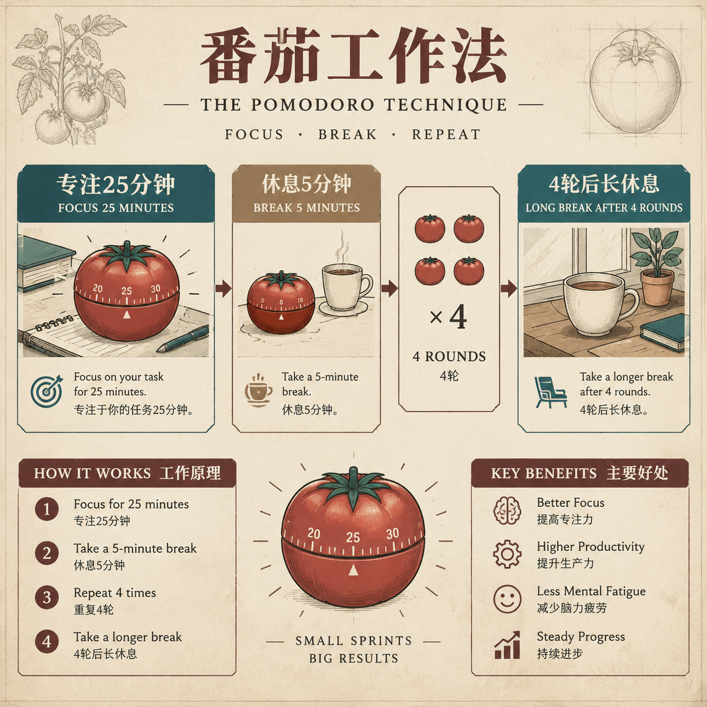

# 叁笙画风手册 · sansheng-stylebook

**选一个画风，让一组静态图沿用同一套画法。** 适用于文章封面和插图，也提供课件、知识卡、信息图、故事、漫画、AI 短剧分镜首帧、动图、音频封面与表情包的试用流程。它是给 Agent 使用的 Skill，不是独立生图模型；实际出图需要当前 Agent 的生图能力、你配置的图像服务，或把编译好的提示词交给其他工具。

> 当前为公开 beta。73 种公开画风都有可调用合同，每种在合同里标注原作灵感来源（画家、工作室、作品）并附同题样图；2026-09-30 画风库重建后全部按新修订待正式准入（其中 5 种曾在旧修订通过测试矩阵，需复测）。样式准入也不等于某种用途的整组验收。公众号文章是首要用途；跨格式与长期个人偏好仍在实际使用中验证。进展以 [能力边界](#能力边界)为准。 [English](./README_EN.md)

## 先看产出

| 画风 | 实际生成的单张测试图 | 能说明什么 |
|---|---|---|
| C01 暖光手绘动画 |  | 人物叙事与暖光画法的一个成功样本 |
| C32 旧纸技术简报 |  | 结构化信息与双语文字的一个成功样本 |

这两张图分别来自同题测试，不代表同一画风的整组跨用途已通过。参考图与预览图的来源、哈希和范围见 [ASSET_PROVENANCE.md](./ASSET_PROVENANCE.md)。

需要短剧或视频的分镜时，官网「AI 短剧分镜」用途下有 10 个画风，每个画风各 4 张样图：一张角色三视图（正、侧、背加三种表情），两张竖屏 9:16 镜头（中景与特写），一张横屏 16:9 电影感远景。分镜只出每个镜头的静态首帧，人物靠三视图跨镜头固定，运动交给视频模型。做法见 [references/scenes/storyboard.md](./references/scenes/storyboard.md)。

需要会动的图时，官网新增「动图」用途，卡片是「静图 → 动图」对比（动画 WebP）。动图只做局部动效：文章插图里的要点按阅读顺序依次出现，表情包和海报做光晕、粒子或呼吸，区域外每一帧不变，所以画风不漂、体积小。收到 `sb2:motion/<码>` 的具体做法见 [references/motion.md](./references/motion.md)。

## 它怎样决定一张图

1. **先理解任务和原文**：分清封面、解释、比较、步骤、人物叙事等用途；为每个位置摘出原文依据、关键关系和需要出现的短文字。没有根据的数字和结论不能补编。
2. **再锁定系列画风和色调**：本次明确选择高于项目锁定、长期偏好和出厂默认。一个系列只用一种样式；允许换色的样式才接受色调调整。
3. **逐张决定表达结构**：同一篇文章可以有主体场景、流程图和对比图。结构取决于该段内容，不能因为用户喜欢人物画就把数字关系都画成人物。
4. **编译、生成、逐张检查**：提示词保留风格合同；出图后核对事实、关系、文字、裁切和整组一致性。失败图与返修记录不冒充准入。

用户可以说“以后文章配图用 C01”“这张改成对比图”“整组颜色更柔和”。一次性改图只改当前任务；明确的长期设置保存在本机，可查看、撤销和忘记。系统只在三个独立任务里观察到一致的主动改选时提高推荐排序，不会从沉默或自动打分推断喜好。

## 安装

需要 Python 3.10+。克隆公开仓并让 Agent 的 Skill 目录指向整个仓目录；Claude Code 也可通过仓内 `.claude-plugin/marketplace.json` 安装。先安装基础依赖：

```bash
git clone --depth 1 https://github.com/sanshengai/sansheng-stylebook.git
cd sansheng-stylebook
python3 -m venv .venv
. .venv/bin/activate
python3 -m pip install -r requirements.txt
python3 scripts/sb.py doctor
```

推荐用 `--depth 1` 浅克隆：完整克隆会带上历史里的旧样图，体积大得多，而出图只用合同与锚点，不读样图。

参与修改时运行 `git config core.hooksPath .githooks` 启用提交前脱敏检查。PPTX 组装另需 `python3 -m pip install -r requirements-ppt.txt`。

**维护者：样图在 `samples` 分支。** 主分支不跟踪 `styles/*/samples/`（只给人在官网选择器里看的样图不随安装分发），它们放在同仓与主分支无共同历史的 `samples` 分支。新克隆后运行 `git fetch origin samples:refs/remotes/origin/samples && python3 scripts/samples_sync.py pull` 取回样图；新样图入库后运行 `python3 scripts/samples_sync.py push` 更新本地 `samples` 分支，再 `git push origin samples`；`python3 scripts/samples_sync.py status` 对比工作区与分支。锚点图（`styles/<码>/anchor.*`）和出图用的范例图不在 `samples/` 下，仍随主分支。

## 日常轻量入口（仓库未发布改进）

现在可用四项逐图计划交给 `python3 scripts/sb.py make brief.json -o 新目录`；内置工具先 `--prepare`，实际成图用 `--prepared` 与 `--import-results` 导回。计划格式和来源绑定见 [轻量出图](references/quick.md)。Skill 接收端支持 `sb2`，网站复制界面尚未升级。

教材新增 `tb-vocab`（单词参考图）和 `tb-grammar`（语法情景图）。单词图默认无字；传一个单词时预留底部标签带，生成后程序排字。其他精确标签可给 overlay 位置配置。单词数量、人物文化、动作和画风仍须看实际图，教材用途尚未正式验收。轻量默认入口已减重，发布档的一键整合和自动成长事件仍在接入。

## 十分钟试用

先编译仓内的虚构示例，检查画风、尺寸和完整提示词：

```bash
python3 scripts/sb.py compile examples/quickstart/manifest.json --json
```

若当前 Agent 有内置生图工具，按 [生图路由](./references/backends.md) 将编译结果里的完整 `prompt` 和参考图交给它。若使用外部图像服务，把密钥放在本机环境变量或运行 `python3 scripts/sb.py setup --env-template` 后自行填写本机配置文件；不要把密钥发给 Agent，也不要提交到仓库。然后运行：

```bash
python3 scripts/sb.py setup
python3 scripts/sb.py generate examples/quickstart/manifest.json -o /tmp/stylebook-first.png
python3 scripts/sb.py qa /tmp/stylebook-first.png --style C32 --manifest examples/quickstart/manifest.json
```

没有图像服务时，`python3 scripts/sb.py inbox examples/quickstart/manifest.json -d /tmp/stylebook-inbox` 会生成可交给其他生图工具的任务包。真实服务调用可能收费；`doctor --deep` 会发起测试图请求。

`qa` 需要可用的独立看图模型，或另外提供可追溯的复核记录；缺少复核者时不能把像素检查结果当作整张通过。

## 选画风、手动调整与记忆

- `python3 scripts/sb.py style-for wxillus`：查看公众号插图的当前默认、候选、选择来源及画风准入状态。当前出厂默认 C24（公众号插图／表情包）、C31（小红书）、C40（信息图）、C30（公众号封面）仍待正式准入；默认能出图不代表成图已通过验收。
- 官网选择器 <https://sanshengai.top/tools/stylebook/>：先逛 73 种画风（每种标原作出处），按用途筛选并换成该用途最需要看的样图——封面看「标题写在图上」、文章插图看「概括图」、小红书看一组 3:4 知识卡、PPT 看三页、竖版信息图、漫画有四格 / 日漫标准页 / 日漫大格页 / 长条漫四种版式；每个风格都配了贴合它气质的主题，点开能按组看整套图；点开一种画风，选用途和色彩，再选「设为我的默认」（记在浏览器里，攒几个后一次复制给 Agent）或「只用这一次」（直接复制一行 `sb2:` 码）。「看色卡」里是 18 个有名字、有故事的色系。本地用 `python3 scripts/sb.py build --gallery` 生成同一份页面（`gallery/build/index.html` 加 `img/`，请在 `gallery/build/` 里起一个静态服务器打开，色调示意需要同源）；`--advanced` 生成旧的完整画廊（内嵌全部样图、含偏好页与选择 JSON 往返）。
- `python3 scripts/sb.py preferences set --scene wxillus --field style --value C01`：设置以后公众号插图的默认画风；`preferences show`、`clear`、`undo`、`forget` 管理记录。详见 [偏好规则](./references/preferences.md)。
- 对整篇文章，先写内容计划并用 `sb.py plan` 检查位置、依据和关系，再使用 `sb.py batch` 或逐张编译。规则见 [内容规划](./references/planning.md)；[合成示例](./examples/content-plan-v2/plan.json)演示计划形状，其中 C31 仍是待准入样式。

## 能力边界

| 功能 | 当前状态 |
|---|---|
| 73 种公开画风合同、色调规则、内容结构编译 | 可调用；全部待按新修订准入，实际用途须另验 |
| 文章内容规划、单张和批量出图、局部返修、质量记录 | 本地可用；配套写作 Skill 已接管出图与排版 |
| 本地画廊与选择 JSON 往返、可撤销的本地偏好 | 已实现；真实长期学习效果仍需连续使用验证 |
| PPT、小红书、信息图、漫画、绘本、音频封面、表情包 | 有实现和旧样例；完整实际消费者验收按格式逐项推进，PPT 中文渲染尚需在目标软件核对 |
| 官网选择器（逛画风 → 选用途与色彩 → 设为默认 / 只用一次，复制一行 sb2 码）、按用途的样图、18 个命名色系 | 已上线；全部画风为“试用中”，尚无通过正式准入者 |
| 动图（文章动态插图、表情包、X 动图） | 只做局部动效，区域外每一帧完全相同，不重画像素、不走图生视频；输出 GIF 与动画 WebP，按公众号、微信表情、X 的体积预算自动降档。公众号、微信、X 的真机自动播放与清晰度尚未验证，对外承诺前要在三个平台各看一次 |
| AI 短剧分镜 | 出每个镜头的静态首帧（可选尾帧）和一张角色三视图，不出视频；运动只写成一行文字交给视频模型。人物跨镜头一致与画面无字仍须看图验收 |
| Codex 订阅额度出图（默认）、按张付费服务（显式备用） | 可用；Codex 单张约 45–100 秒，比中转服务慢，但不额外花钱 |
| 成长飞轮（自动记录选择 / 采用 / 返修，同向 3 个任务问一次） | 已实现；长期效果仍需连续使用验证 |
| 跨设备记忆同步、视频、Logo | 当前未提供 |

两种私有画风及其默认值不在公开包中。个人记忆默认留在 `~/.config/sansheng-stylebook/profile/`，可用 `STYLEBOOK_PROFILE` 指向自己的私有目录；显式指定的目录若不存在，本次不读取默认私有目录。图像服务适配的实测范围见 [后端说明](./references/backends.md)；未实测的适配器不会写成已验收。

## 更新、致谢与许可

变更见 [CHANGELOG.md](./CHANGELOG.md)。风格描述、排版思路和工作流参考过 [threerocks/hand-drawn-styles](https://github.com/threerocks/hand-drawn-styles)、[JimLiu/baoyu-skills](https://github.com/JimLiu/baoyu-skills) 与 [yang0/handraw-style](https://github.com/yang0/handraw-style)；具体改写范围和许可原文见 [THIRD_PARTY_NOTICES.md](./THIRD_PARTY_NOTICES.md)。感谢这些作者公开方法与代码。

本仓采用 [MIT License](./LICENSE)。维护者：叁笙（sansheng）。
